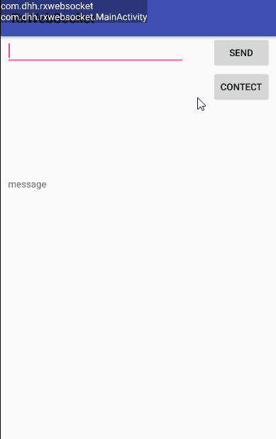
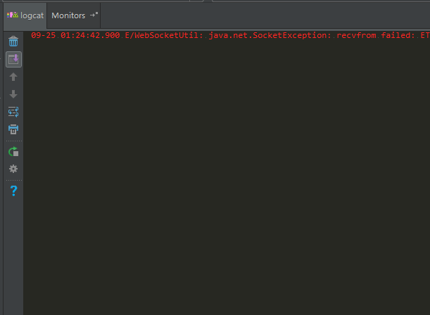

# RxWebSocket #
[](https://developer.android.com/index.html) 
[  ](https://bintray.com/dhhandroid/maven/RxWebSocket2/_latestVersion)
[  ](https://developer.android.com/about/versions/android-3.0.html)
[  ](http://www.apache.org/licenses/LICENSE-2.0)
## 这是RxJava2版本
## RxWebSocket是一个基于okhttp和RxJava封装的WebSocket客户端,此库的核心特点是  除了手动关闭WebSocket(就是RxJava取消订阅),WebSocket在异常关闭的时候(onFailure,发生异常,如WebSocketException等等),会自动重连,永不断连.其次,对WebSocket做的缓存处理,同一个URL,共享一个WebSocket.
## 原理解析: [戳我戳我戳我](http://blog.csdn.net/huiAndroid/article/details/78071703)
## [RxJava1版本点我](https://github.com/dhhAndroid/RxWebSocket)
### [查看changeLog](https://github.com/dhhAndroid/RxWebSocket/blob/1.x/ChangeLog.md)
## 效果图 ##

### 断网重连测试


## how to use ##

### 添加依赖: ###

#### 在项目module下gradle加入:
```

	compile 'com.dhh:websocket2:1.5.0'
	
```
### init
```

        //if you want to use your okhttpClient
        OkHttpClient yourClient = new OkHttpClient();
        RxWebSocketUtil.getInstance().setClient(yourClient);
		// show log,default false
        RxWebSocketUtil.getInstance().setShowLog(true);

```
### WSS support
```

        //wss support
        RxWebSocketUtil.getInstance().setSSLSocketFactory(yourSSlSocketFactory,yourX509TrustManager);
        RxWebSocketUtil.getInstance().getWebSocket("wss://...");
        //or
        OkHttpClient client = new OkHttpClient.Builder()
                .sslSocketFactory(yourSSlSocketFactory, yourX509TrustManager)
                //other config...
                .build();
        RxWebSocketUtil.getInstance().setClient(client);
```
### open WebSocket

```

        mDisposable = RxWebSocketUtil.getInstance().getWebSocketInfo(url)
                //bind on life
                .takeUntil(bindOndestroy())
                .subscribe(new Consumer<WebSocketInfo>() {
                    @Override
                    public void accept(WebSocketInfo webSocketInfo) throws Exception {
                        mWebSocket = webSocketInfo.getWebSocket();
                        if (webSocketInfo.isOnOpen()) {
                            Log.d("MainActivity", " on WebSocket open");
                        } else {

                            String string = webSocketInfo.getString();
                            if (string != null) {
                                Log.d("MainActivity", string);
                                textview.setText(Html.fromHtml(string));

                            }

                            ByteString byteString = webSocketInfo.getByteString();
                            if (byteString != null) {
                                Log.d("MainActivity", "webSocketInfo.getByteString():" + byteString);

                            }
                        }

                    }
                });
	
	mWebSocket.send("hello word");

        // use WebSocketSubscriber
        RxWebSocketUtil.getInstance().getWebSocketInfo(url)
                .subscribe(new WebSocketSubscriber() {
                    @Override
                    public void onOpen(@NonNull WebSocket webSocket) {
                        
                    }

                    @Override
                    public void onMessage(@NonNull String text) {

                    }

                    @Override
                    public void onMessage(@NonNull ByteString bytes) {

                    }

                    @Override
                    public void onSubscribe(@NonNull Disposable d) {

                    }
                });
                
        // use WebSocketConsumer
        RxWebSocketUtil.getInstance().getWebSocketInfo("ws://10.7.5.88:8089")
                .compose(RxLifecycle.with(this).<WebSocketInfo>bindOnDestroy())
                .subscribe(new WebSocketConsumer() {
                    @Override
                    public void onOpen(WebSocket webSocket) {

                    }

                    @Override
                    public void onMessage(String text) {

                    }

                    @Override
                    public void onMessage(ByteString bytes) {

                    }
                });        

        //get StringMsg
        RxWebSocketUtil.getInstance().getWebSocketString(url)
                .subscribe(new Consumer<String>() {
                    @Override
                    public void accept(String s) throws Exception {

                    }
                });
        // get ByteString
        RxWebSocketUtil.getInstance().getWebSocketByteString(url)
                .subscribe(new Consumer<ByteString>() {
                    @Override
                    public void accept(ByteString byteString) throws Exception {

                    }
                });
        //get WebSocket
        RxWebSocketUtil.getInstance().getWebSocket(url)
                .subscribe(new Consumer<WebSocket>() {
                    @Override
                    public void accept(WebSocket webSocket) throws Exception {

                    }
                });
        //with timeout
        RxWebSocketUtil.getInstance().getWebSocketInfo(url, 10, TimeUnit.SECONDS)
                .subscribe(new Consumer<WebSocketInfo>() {
                    @Override
                    public void accept(WebSocketInfo webSocketInfo) throws Exception {

                    }
                });
```
```  

	// Rxbinding
    RxView.clicks(centect)
            .flatMap(new Function<Object, ObservableSource<String>>() {
                @Override
                public ObservableSource<String> apply(@NonNull Object o) throws Exception {
                    return RxWebSocketUtil.getInstance().getWebSocketString(url);
                }
            })
            .subscribe(new Consumer<String>() {
                @Override
                public void accept(String s) throws Exception {
                    //the s !=null

                    Log.d("MainActivity", s);
                    textview.setText(Html.fromHtml(s));
                }
            });
```
### 发送消息 ###
```

	  //用WebSocket的引用直接发
	  mWebSocket.send("hello word");
	
	  //url 对应的WebSocket已经打开可以这样send,否则报错
	  RxWebSocketUtil.getInstance().send(url, "hello");
	  RxWebSocketUtil.getInstance().send(url, ByteString.EMPTY);
	
	  //异步发送,若WebSocket已经打开,直接发送,若没有打开,打开一个WebSocket发送完数据,直接关闭.
	  RxWebSocketUtil.getInstance().asyncSend(url, "hello");
	  RxWebSocketUtil.getInstance().asyncSend(url, ByteString.EMPTY);
```
### 注销 ###
### RxJava的注销方式,就可以取消订阅. 优雅地处理RxJava注销,请查看我另外一个项目:[RxLifecycle](https://github.com/dhhAndroid/RxLifecycle).

```

    Disposable mDisposable = RxWebSocketUtil.getInstance().getWebSocketString("ws://sdfs").subscribe();
	//注销
    if(mDisposable != null && !mDisposable.isDisposed()) {
        mDisposable.dispose();
    }

```
## 更优雅的注销处理方式,请看我的另一个项目: [RxLifecycle](https://github.com/dhhAndroid/RxLifecycle),优雅地处理RxJava注销问题,和Activity生命周期绑定.
## 如果本库对你有帮助,谢谢您的star!
License
-------

    Licensed under the Apache License, Version 2.0 (the "License");
    you may not use this file except in compliance with the License.
    You may obtain a copy of the License at

       http://www.apache.org/licenses/LICENSE-2.0

    Unless required by applicable law or agreed to in writing, software
    distributed under the License is distributed on an "AS IS" BASIS,
    WITHOUT WARRANTIES OR CONDITIONS OF ANY KIND, either express or implied.
    See the License for the specific language governing permissions and
    limitations under the License.
